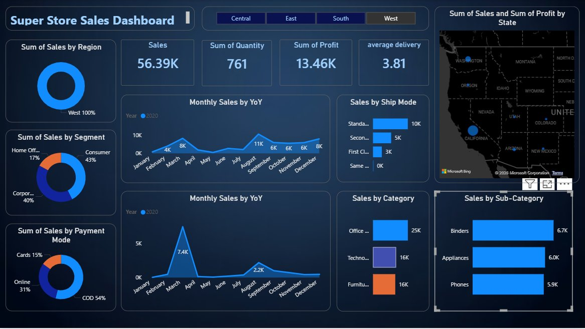

# 🛒 Superstore Sales Dashboard — Power BI

An interactive Power BI dashboard analyzing Superstore sales data across regions, categories, and time periods.

## 📊 Dashboard Overview

This project provides end-to-end sales analytics including revenue trends, profit margins, regional performance, and product category breakdowns using the classic Superstore dataset.



## 🗂️ File Structure

```
superstore-powerbi-dashboard/
├── NEW_superstore_project_powerbi_new1.pbix   # Main Power BI report file
├── dashboard_screenshot.png                   # Dashboard preview image
├── README.md                                   # Project documentation
└── .gitignore                                  # Git ignore rules
```

## 🚀 Getting Started

### Prerequisites
- [Power BI Desktop](https://powerbi.microsoft.com/desktop/) (free download)

### How to Open
1. Clone this repository:
   ```bash
   git clone https://github.com/YOUR_USERNAME/superstore-powerbi-dashboard.git
   ```
2. Open `NEW_superstore_project_powerbi_new1.pbix` in Power BI Desktop

## 📈 Key Insights Covered
- Sales & Profit by Region
- Category and Sub-Category Performance
- Monthly/Yearly Sales Trends
- Top Customers and Products
- Discount vs Profit Analysis

## 🛠️ Tools Used
- **Power BI Desktop**
- **DAX** for calculated measures
- **Power Query** for data transformation

## 📬 Contact
Feel free to open an issue or reach out for any questions!
